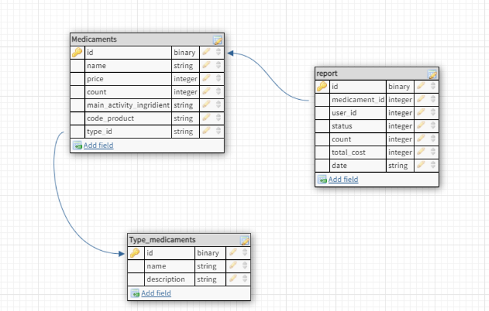
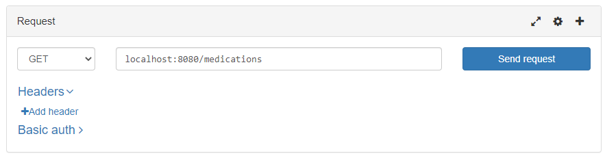
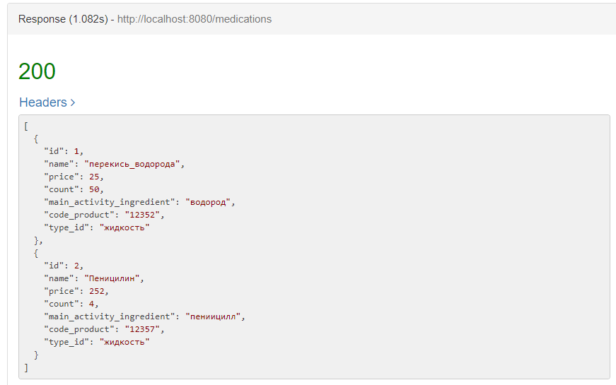
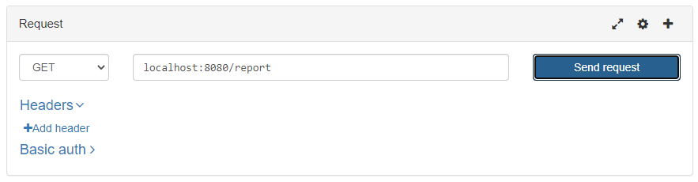
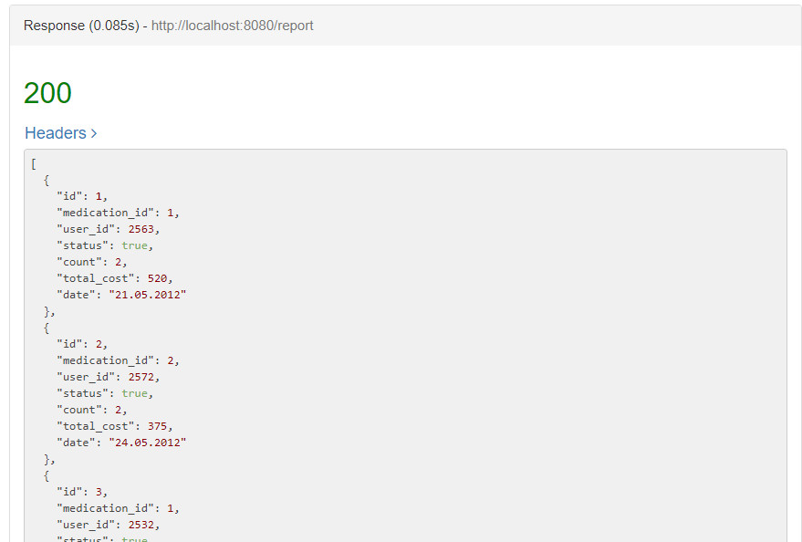
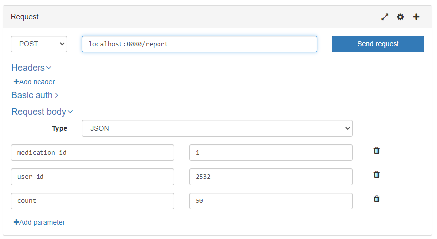
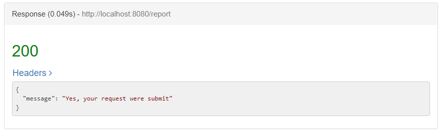
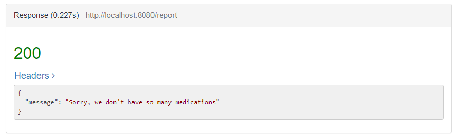

# RestApi для модуля медецинской системы 

## Модуль "Аптека"

Для старта использован Spring Initializr 

**[Spring Initializr](https://start.spring.io/)**

В нем необходимо добавить в зависимости 
+ Spring Web, 
+ PostgreSQL 
+ Spring JDBC
___

## База данных

Каждой таблице из БД соответствует сущность, хранящая данные одной записи, и репозиторий, реализующий функции доступа к таблице - Create, Read, Update, Delete (CRUD)

Каждой таблице соответствует один ресурс, он же является сущностью, однако ресурсы могут также не полностью соответствовать полям в таблицах, агрегировать данные из нескольких таблиц или вообще не иметь отношения к БД.

Для каждого ресурса реализован класс контроллера ( Контроллер в паттерне MVC). Класс контроллера занимается обработкой запроса, например десериализует экземпляр ресурса из тела запроса, вызывает методы репозиториев и сервисов, создает ответ, например сериализует экземпляр ресурса, выдаваемого в ответ на запрос. 

В запросе на получение медикаментов проверяется налицие этого компонента, и если он есть, то соответствоенно в бд отправляется два запроса: 
+ первый обновляет данные о количестве медикаментов
+ второй добавляет новую запись в таблицу отчета 
___

## User Story

+ Пользователь может просмотреть каталог всех препаратов, которые есть в аптеке, для того, чтобы купить их 
+ Врач может отправить запрос на выдачу каких-либо препаратов. 
+ Врач может просмотреть все запросы отправленные врачами

___

## API

</domain/>/pharmacy /</method/>

___

### Получение всех медикаментов

<.domain>/pharmacy/medications

*Request:*

Request Method: GET

*Response:*

Response Body (type json):

	{
	“id”: 12321, 
	“name”: “name_medicaments”, 
	“price”: 8532, 
	“count”: 85,
	“main_activity_ingridient”: ‘псилоцитин”,
	“code_product”: “2362”,
	“type_id”: “жидкость”
	},

___

### Получение всех запросов

<.domain>/ pharmacy/report

*Request:*

Request Method: GET

*Response:*

Response Body (type json):

    {
	“id”: 121, 
	“medication_id”: 23, 
	“user_id”: <user_id>, 
	“status”: true,
	“count”: 25,
	“total_cost”: 236,
	“date”: “12.03.12”
    }.

___

### Отправка запроса на получение медикаментов

<.domain>/pharmacy/report

**Request:**

Request Method: POST

Request Body: 

    { 
	“medication_id”: 23, 
	“user_id”: <user_id>, 
	“count”: 25,	
    }

**Response:**

Request Body (type json):

    {
	“message”: “К сожалению, на складе нет столько необходимого лекарства”
    }

___ 

## Тестировние API

Тестирование проводилось с помощью бесплатного REST клиента [RESTED](chrome-extension://eelcnbccaccipfolokglfhhmapdchbfg/dist/index.html)

### Отправка get запроса на медикаменты

### Получение ответа

___

### Отправка get запроса на получение отчета

### Получение ответа

___

### Отправка post запроса на запрос лекарств

### Получение ответа если медикаменты есть

### Получение ответа если медикаментов нет

